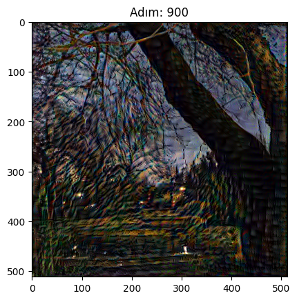

# Neural Style Transfer ile Sanatsal Dönüşüm 🎨

Bu projede, derin öğrenme (VGG-19) kullanarak kişisel bir fotoğrafı Van Gogh tarzına dönüştürdüm.

## Proje Hikayesi
Bu proje sırasında derin öğrenmenin temel kavramlarını (Loss functions, Gram Matrix, Optimization) öğrendim. 
İlk denemelerimde stil ağırlığı düşük olduğu için görselde değişim azdı, ancak **hiperparametre optimizasyonu** yaparak stil baskınlığını artırdım ve istediğim sonuca ulaştım.

## Kullanılan Teknolojiler
- **Framework:** TensorFlow / Keras
- **Model:** VGG-19 (Pre-trained)
- **Teknik:** Neural Style Transfer

## Sonuçlar
| Orijinal Fotoğraf | Van Gogh Tarzı |  
|---|---|
|  |  | !
